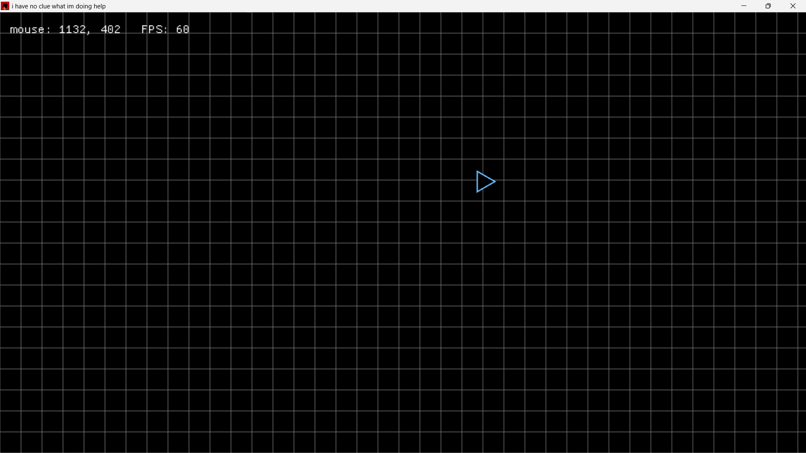

# triangle_agent

My first Rust and macroquad project.
A triangle that rotates, chases the mouse, and stops at walls.

I wrote it while having absolutely no clue what I'm doing,
but somehow it works.
